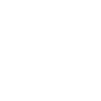

<div align="center">

  

  # DailyBurn
  
  **Your Intelligent, Adaptive Fitness Companion**

  <p>
    <a href="#-features">Features</a> •
    <a href="#-tech-stack">Tech Stack</a> •
    <a href="#-getting-started">Getting Started</a>
  </p>

  [](https://reactjs.org/)
  [](https://vitejs.dev/)
  [](https://tailwindcss.com/)
  [](https://capacitorjs.com/)
  <br />
  <a href="https://www.buymeacoffee.com/naveenakalanka" target="_blank"></a>

</div>

<br />

> **Train Smarter, Not Harder.** DailyBurn is a science-based workout planner that adapts to your equipment, fitness level, and schedule. Whether you're at home or in the gym, get a plan that works.

---

## 🌟 Features

- **🧠 Smart Plan Generation**: Algorithms that build balanced 7-day splits based on your focus (Hypertrophy, Strength, etc.).
- **🏋️ Exercise Library**: Comprehensive database with video tutorials and muscle-group filtering.
- **📅 Weekly Schedule**: Interactive calendar to track your weekly progress and upcoming sessions.
- **💾 Local First & Secure**: 
  - **Web**: Uses local storage for instant access.
  - **Mobile**: Uses Native Secure Storage for reliable data persistence on iOS & Android.
- **📱 Fully Responsive & Native**: Built as a PWA, usable on desktop or installed as a native app via Capacitor.
- **🎨 Modern UI**: 
  - **Dark Mode**: Fully supported system-wide dark theme.
  - **Glassmorphism**: Sleek, modern aesthetic with smooth animations.

## 🛠️ Tech Stack

- **Frontend**: React (v18)
- **Build Tool**: Vite
- **Styling**: Tailwind CSS + Custom Animations
- **Mobile Runtime**: Capacitor (Android & iOS)
- **Icons**: React Icons (Material Design)
- **Charts**: Recharts for progress visualization
- **State/Logic**: Context API + Custom Hooks

## 🚀 Getting Started

1.  **Clone the repository**
    ```bash
    git clone https://github.com/NaveenAkalanka/DailyBurn.git
    cd DailyBurn
    ```

2.  **Install dependencies**
    ```bash
    npm install
    # For native mobile plugins
    npm i @capacitor/preferences @capacitor/core
    ```

3.  **Run the development server**
    ```bash
    npm run dev
    ```

4.  **Open locally**
    Visit `http://localhost:5173` in your browser.

## 📱 Mobile Build

DailyBurn is ready for mobile!

```bash
# Build the web assets
npm run build

# Sync with native projects
npx cap sync

# Open Android Studio
npx cap open android

# Open Xcode (Mac only)
npx cap open ios
```

<br />

<div align="center">
  <p class="text-sm text-gray-500">
    Designed & Developed with ❤️ by <a href="https://github.com/NaveenAkalanka">Naveen Akalanka</a>
    <br />
    <a href="https://www.buymeacoffee.com/naveenakalanka">Support the Project ☕</a>
  </p>
</div>
